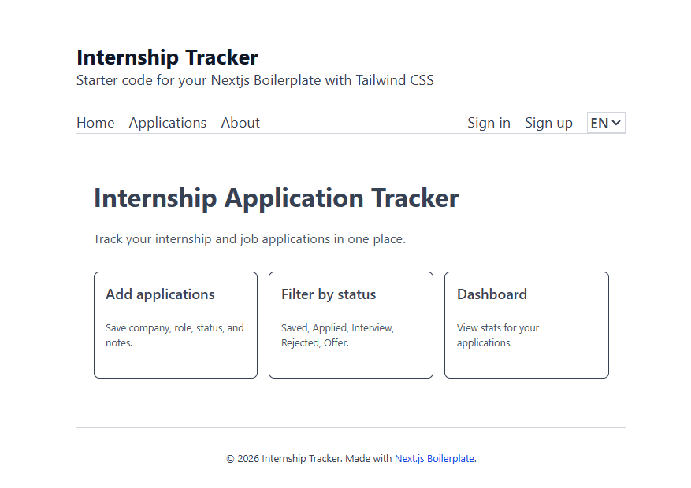
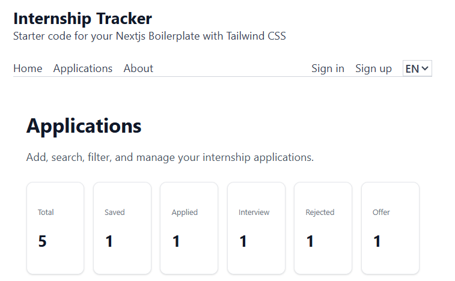
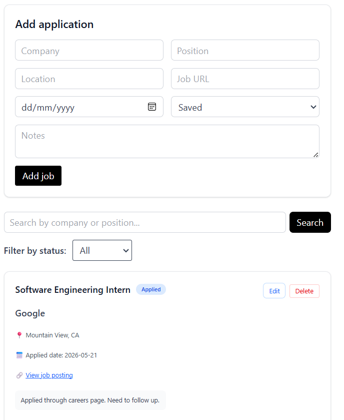
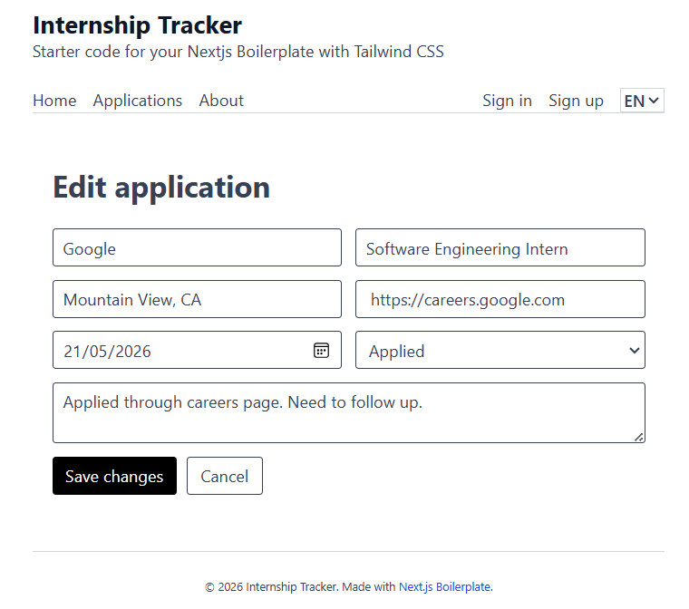

# Internship Application Tracker

A full-stack web application for tracking internship and job applications.

## Live Demo

https://internship-tracker-dashboard-blue.vercel.app

## Features

- Add new job/internship applications
- View all applications
- Edit application details
- Delete applications with confirmation
- Filter applications by status
- Search by company or position
- Dashboard statistics by application status
- Persistent database storage

## Application Statuses

- Saved
- Applied
- Interview
- Rejected
- Offer

## Tech Stack

- Next.js
- TypeScript
- Tailwind CSS
- Drizzle ORM
- PostgreSQL / PGlite
- React Server Actions

## Getting Started

Install dependencies:

```bash
npm install
```
## Screenshots

### Dashboard







### Edit Application




## Author

**Ho Ngoc Quy**

- GitHub: https://github.com/ng-quys
- Email: hnquy08@gmail.com
